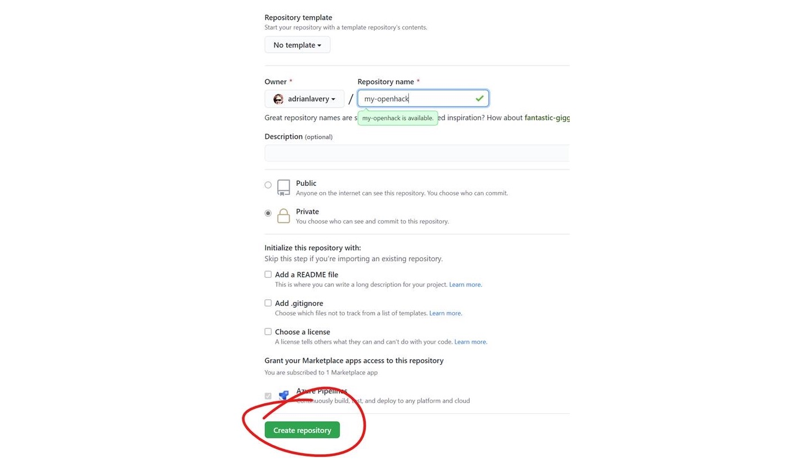

<div align="center" id="top"> 
  

  &#xa0;

  <!-- <a href="https://openhackcontainersenvsetup.netlify.app">Demo</a> -->
</div>

<h1 align="center">Openhack Containers Envsetup</h1>

<p align="center">
  

  

  

  

  <!--  -->

  <!--  -->

  <!--  -->
</p>

<!-- Status -->

<!-- <h4 align="center"> 
	🚧  Openhack Containers Envsetup 🚀 Under construction...  🚧
</h4> 

<hr> -->

<p align="center">
  <a href="#dart-about">About</a> &#xa0; | &#xa0; 
  <a href="#sparkles-features">Features</a> &#xa0; | &#xa0;
  <a href="#rocket-technologies">Technologies</a> &#xa0; | &#xa0;
  <a href="#white_check_mark-requirements">Requirements</a> &#xa0; | &#xa0;
  <a href="#checkered_flag-starting">Starting</a> &#xa0; | &#xa0;
  <a href="#memo-license">License</a> &#xa0; | &#xa0;
  <a href="https://github.com/{{YOUR_GITHUB_USERNAME}}" target="_blank">Author</a>
</p>

<br>

## :dart: About ##

This readme file explains how to get the Source Code repository set up for the Microsoft Containers Hack.  It is mandated that a PRIVATE Github repository is created by a participant in every hack team and all other participants work locally and contribute to this central private repository. 

Each hack particpiant will contribute directly to this repository, rather than clone it.

<!--## :sparkles: Features ##

:heavy_check_mark: Feature 1;\
:heavy_check_mark: Feature 2;\
:heavy_check_mark: Feature 3; -->

## :rocket: Technologies ##

The following tools were used in this project:

- [Visual Studio Codespaces](https://expo.io/) OR 
- [Github Codespaces](https://github.com/codespaces) 


## :white_check_mark: Requirements ##

Before starting :checkered_flag:, you need to have a Github Account [GitHub Signup](https://github.com/join?).

## :checkered_flag: Starting ##

1) Create a new repo.  For the repo name, use 'Teamx-OurContOH' - replacing 'x' with your team number



<!--
```bash
# Clone this project
$ git clone https://github.com/{{YOUR_GITHUB_USERNAME}}/openhack-containers-envsetup

# Access
$ cd openhack-containers-envsetup 

```
-->

## :memo: License ##

This project is under license from MIT. For more details, see the [LICENSE](LICENSE.md) file.


Made with :heart: by <a href="https://github.com/{{YOUR_GITHUB_USERNAME}}" target="_blank">{{YOUR_NAME}}</a>

&#xa0;

<a href="#top">Back to top</a>
