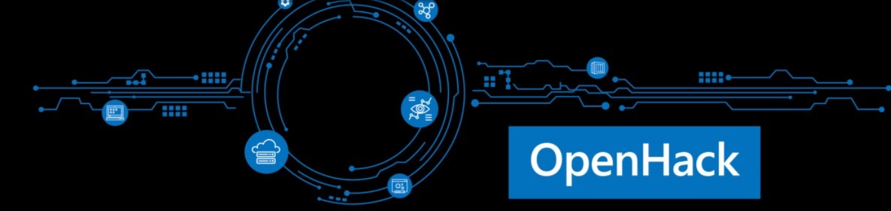
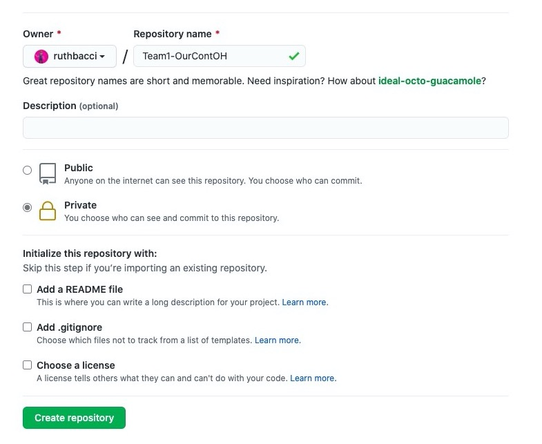
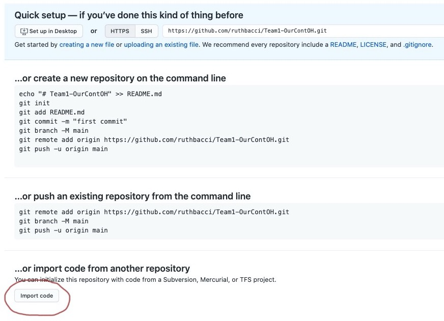
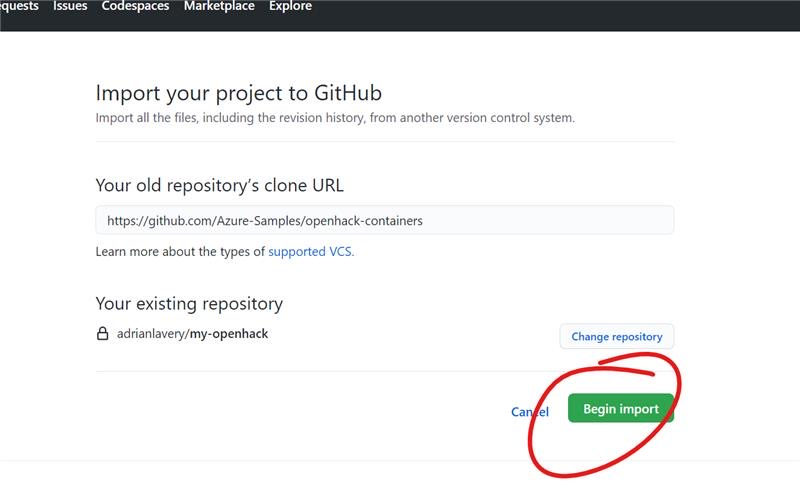
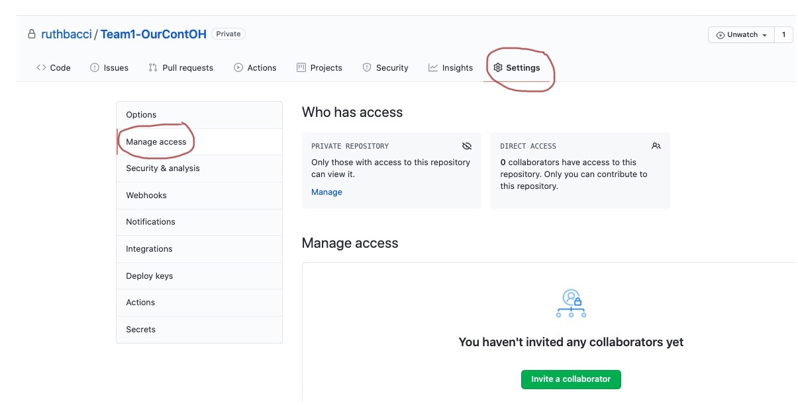
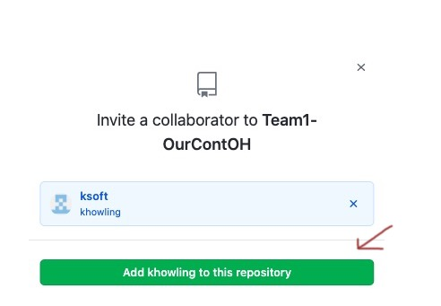

<div align="center" id="top"> 
  

  &#xa0;

  <!-- <a href="https://openhackcontainersenvsetup.netlify.app">Demo</a> -->
</div>

<h1 align="center">Openhack Containers Environment Setup</h1>

<p align="center">
  

  

  

  

  <!--  -->

  <!--  -->

  <!--  -->
</p>

<!-- Status -->

<!-- <h4 align="center"> 
	🚧  Openhack Containers Envsetup 🚀 Under construction...  🚧
</h4> 

<hr> -->

<p align="center">
  <a href="#dart-about">About</a> &#xa0; | &#xa0; 
  <a href="#rocket-technologies">Technologies</a> &#xa0; | &#xa0;
  <a href="#white_check_mark-requirements">Requirements</a> &#xa0; | &#xa0;
  <a href="#checkered_flag-starting">GitHub</a> &#xa0; | &#xa0;
    <a href="#checkered_flag-starting">VSO CodeSpaces</a> &#xa0; | &#xa0;
  <a href="#memo-license">License</a> &#xa0; | &#xa0;
  <a href="https://github.com/{{YOUR_GITHUB_USERNAME}}" target="_blank">Author</a>
</p>

<br>

## :dart: About ##

This readme file explains how to get the Source Code repository set up for the Microsoft Containers Hack.  It is mandated that a PRIVATE Github repository is created by a participant in every hack team and all other participants work locally and contribute to this central private repository. 

Each hack particpiant will contribute directly to this repository, rather than clone it.

In addition, if you don't already have an environment setup to execute the hack from, you will find the instructions on how to set up a Visual Studio Codespace to execute all of the hack challenges from. 

<!--## :sparkles: Features ##

:heavy_check_mark: Feature 1;\
:heavy_check_mark: Feature 2;\
:heavy_check_mark: Feature 3; -->

## :rocket: Technologies ##

The following tools were used in this project:

- [GitHub](https://github.com/)
- [Visual Studio Codespaces](https://online.visualstudio.com/login)

<br>

## :white_check_mark: Requirements ##

Before starting :checkered_flag:, you need to have a Github Account [GitHub Signup](https://github.com/join?).
<br>
<br>


## :checkered_flag: Instructions for Setting Up Github ##

Follow the Instructions below to create a Private repository and copy the source code that you will need 

1) Create a new repo.  For the repo name, use 'Teamx-OurContOH' - replacing 'x' with your team number.  

*IMPORTANT* You MUST create this repo as a PRIVATE Repo and only ONE member of your hack team needs to perform this step (Everyone in the team will connect and work from the same repo)

Make sure not to check any of the boxes to initiate it and click create. 


<br>

2) Once the repo has been created, you will see the Quick Setup page, scroll to the bottom and click 'Import Code'


<br>

3) In the field 'Your old repository's clone URL' enter the URL of the Containers Hack Repo : 'https://github.com/Azure-Samples/openhack-containers' and click on 'Begin Import'



<br>

## Grant your fellow hackers access to the repo ##

1) Once you have created your private repo and imported the source code you now need to invite your hacker team collegues to collaborate to the repo with you. Navigate to the 'Settings' area of your repo and click on 'Manage Access'



2) Ask the hacker for their GitHub Username and enter it into the Username field, then click on 'Invite <username> to this repository'



Repeat step 2 until all the members of your hacker team have been invited to collaborate

## :computer: Instructions for Setting Up Visual Studio CodeSpaces ##

The pre-requist for the hack was to 


Visual Studio Codespaces provides you with a cloud-powered dev enviroment that you can access from anywhere. If you have not already created an environment / Server in which you can execute the hack challenges from 

<!--
```bash
# Clone this project
$ git clone https://github.com/{{YOUR_GITHUB_USERNAME}}/openhack-containers-envsetup

# Access
$ cd openhack-containers-envsetup 

```
-->
<br>

## :memo: License ##

This project is under license from MIT. For more details, see the [LICENSE](LICENSE.md) file.


Made with by <a href="https://github.com/ruthbacci" target="_blank">Ruth Bacci</a>

&#xa0;

<a href="#top">Back to top</a>
